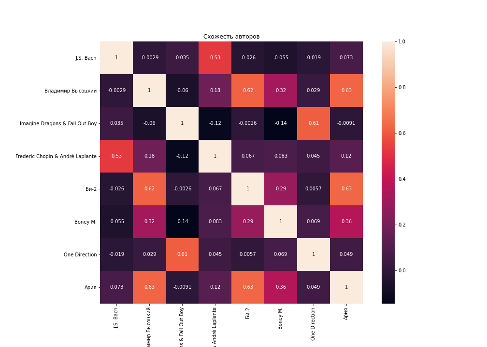

# Artists-recommendation
CoreML(VK) task for ML internship. Artists recommendation problem based on 30Music dataset. Solving useing CBOW technique.

GitHub не разрешает размещать файлы > 100MB, поэтому данные сохранены на [Google Drive](https://drive.google.com/drive/folders/1lM1xFHiKYI6_7crX66-DhQ42wit3eDaQ?usp=sharing)

## Примеры результатов:

You can run your own tests [here](https://artist-recommend.herokuapp.com/).

*Чем светлее ячейка - тем более похожи авторы и наоборот*

Пример рекомендации к группе **Ария**:

- Алиса
- Гражданская Оборона
- Владимир Высоцкий
- Би-2
- Аквариум  & Дживан Гаспарян
- DDT
- ... (продолжение в [CoreML ноутбуке](CoreML%20(Artist%20recommendation).ipynb))

## Задача
Ваша задача — научиться искать похожих музыкальных исполнителей.

В терминах машинного обучения это означает, что для каждого исполнителя нужно построить векторное представление таким образом, чтобы похожие исполнители оказались близко в векторном пространстве, тогда задача поиска похожих исполнителей сведётся к задаче поиска ближайших соседей.

Оценивать качество полученных векторных представлений будем на задаче Artist Recommendation — рекомендация исполнителя для пользователя.

Данные: [30Music](http://recsys.deib.polimi.it/datasets/)

Датасет состоит из событий о разбитых на сессии прослушиваниях музыки пользователями сайта Last.fm.
Датасет также содержит много дополнительной информации о треках, исполнителях, альбомах и т. д.

Более подробное описание данных можно найти в оригинальной [статье](http://ceur-ws.org/Vol-1441/recsys2015_poster13.pdf).

Формат файлов описан [тут](https://github.com/crowdrec/idomaar/wiki/DATA-FORMAT).

